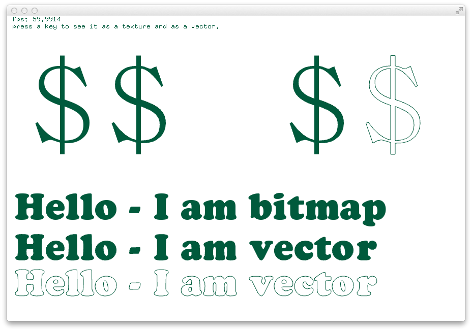

# About fontShapesExample




### Learning Objectives

This example demonstrates several methods of drawing strings and characters using TrueType font. In this demonstration, text is drawn in the following ways:

* Character drawn as a font bitmap
* Character drawn as a filled vector
* Character drawn as filled polygons
* Character drawn as unfilled polygons


* String drawn as a font bitmap
* String drawn as a filled vector
* String drawn as an unfilled vector


This example covers the following functions:

* ofTrueTypeFont and ofTTFCharacter as data types
* ````drawString()``` and ```drawStringAsShapes()```
* ```getCharacterAsPoints()``` and ```setFilled()```
* ```getOutline()``` and ```getVertices()``` to access polygon information for strings and characters

In the code, pay attention to: 


* Note the difference between ```drawString()``` which draws a bitmap of the font, and ```drawStringAsShapes()``` which draws the font as a vector
* Use of the function ```font.getCharacterAsPoints()``` to return the point outline of a character
* Explore drawing characters with and without fill: ```testChar.setFilled(true)``` and ```testChar.setFilled(false)```
* Use of ```ofTTFCharacter.getOutline()``` to extract polygon outlines from a character
* Use of ```ofTTFCharacter.getOutline()[i].getVertices()``` to extract vertices from each [i] polygon outline


### Expected Behavior

When launching this app, you should see a white screen with green text displaying a variety of characters and text. The large individual characters should update on key press, and the bottom rows of text should display strings in bitmap and vector.

### Instructions for use:

* Type any key to update the displayed character

### Other classes used in this file

This example uses no other classes.