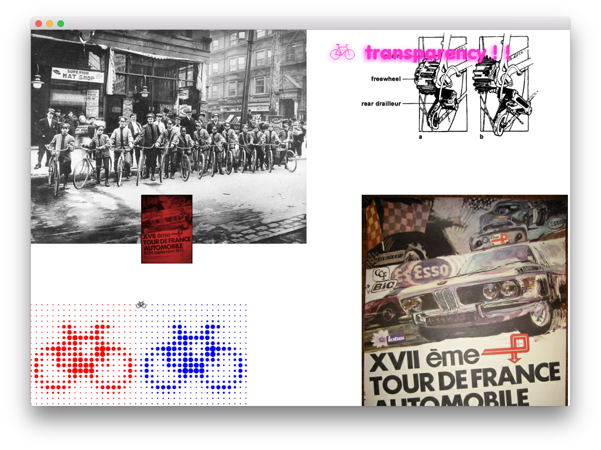

#About Image Loader Example




###Learning Objectives

This example demonstrates the loading of image assets, resizing them, setting their image type.  

In the code, pay attention to: 

* Use ```ofImage.load()``` to load in images
* Use ```ofImage.resize()``` to resize images
* The enumerators for the different image types including ```OF_IMAGE_GRAYSCALE```, ```OF_IMAGE_COLOR```, ```OF_IMAGE_COLOR_ALPHA```, ```OF_IMAGE_UNDEFINED```
* The pointillism type of effect drawn based on the brightness of the pixels from an image using ```ofDrawCircle```
* Animation of the transparent image utilizing ``` sin(ofGetElapsedTimef());```

 
### Expected Behavior

When launching this application you will see: 

* Several different images loaded in
* An image with transparency animating in the top right
* An image tinted red
* An image that is created with a pointillism effect from a loaded image

Instructions for use:


###Other classes used in this file

This Example uses no other classes.