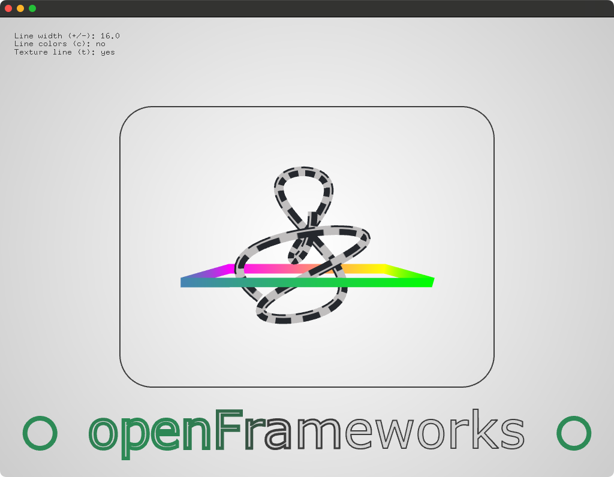

# About linesExample




### Learning Objectives

This Example demonstrates various methods of working with lines by using polylines, meshes and draw functions.

This example covers the following functions:

* Setting different line widths using ```ofSetLineWidth(lineWidth)``` and ```path.setStrokeWidth()```.
* Different approaches for rendering lines using drawing methods, meshes, paths, fonts and polylines.
* Building meshes for line rendering with ```mesh.addVertex()```, ```mesh.addTexCoord()``` and ```mesh.addColor()```.

In the code, pay attention to: 

* Different ways to set the line width using ```ofSetLineWidth(lineWidth)``` and ```testRectPath.setStrokeWidth(2.);```.
* Methods for texturing a mesh rendered with lines by adding texture coordinates.
* Use different methods of line rendering for meshes ```OF_PRIMITIVE_LINE_STRIP``` and ```OF_PRIMITIVE_LINE_LOOP```
* Rendering outlines by using ```ofNoFill()``` and ```ofDrawCircle()```.
* Pushing and popping styles like color using ```ofPushStyle()``` and ```ofPopStyle()```
* Rendering bitmap text to the screen, with ```ofDrawBitmapString()```.

### Expected Behavior

When launching this app, you should see a screen with

* A wiggly line in the middle of the screen.
* A colored box mesh moving up and down around the wiggly line.
* openFrameworks rendered as text at the bottom of the screen.

### Instructions for use:

* Press ```-``` or ```+``` to decrease / increase the line width.
* Press ```c``` to toggle colors on the wiggly line.
* Press ```t``` to toggle textures on the wiggly line.

### Other classes used in this file

This Example uses no other classes.
