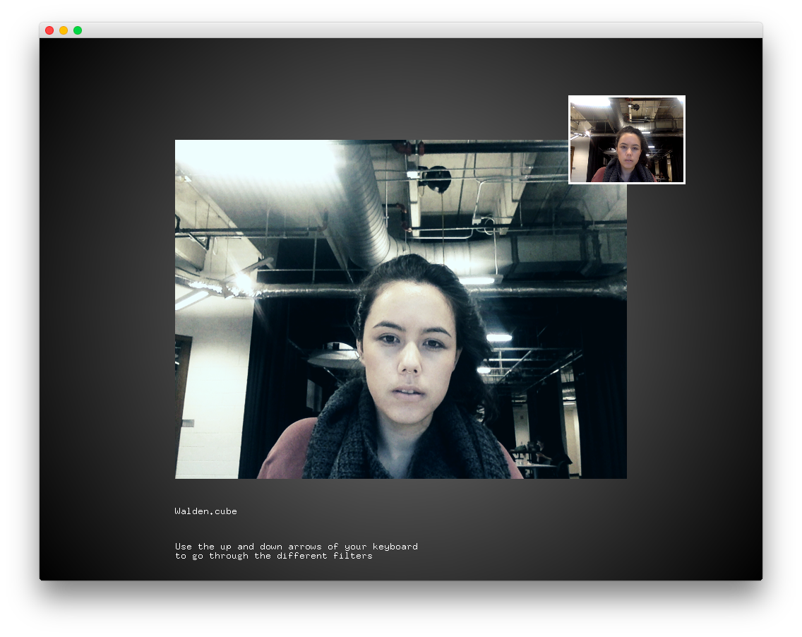

#Level2_lutFilterExample
--


### Learning Objectives

This openFrameworks Example is designed to demonstrate how to create LUT filters. LUT stands for "Look Up Table". Final Image = Source Image + LUT where LUT is the difference bewtween your desired outcome and your source. 

In this example, pay attention to the following code:

* ```void loadLUT(string path)``` 
* ```void applyLUT(ofPixelsRef pix)``` uses ```glm::vec3``` and ```imgageName.setColor(x, y, color)``` to alter the color of every pixel of the image


### Expected Behavior

When launching this app, you should see:

* a large image in the center of the screen and a small small image located at the uper left hand corner of this rectangle; both images will have your camera feed showing. The larger image will showcase a filter
* text showcasing what filter is being overlayed is at the bottom of the screen

Instructions for use:

* Use the up and down keys to filter through the list


### Other classes used in this file

This Example does not use any other classes. 
