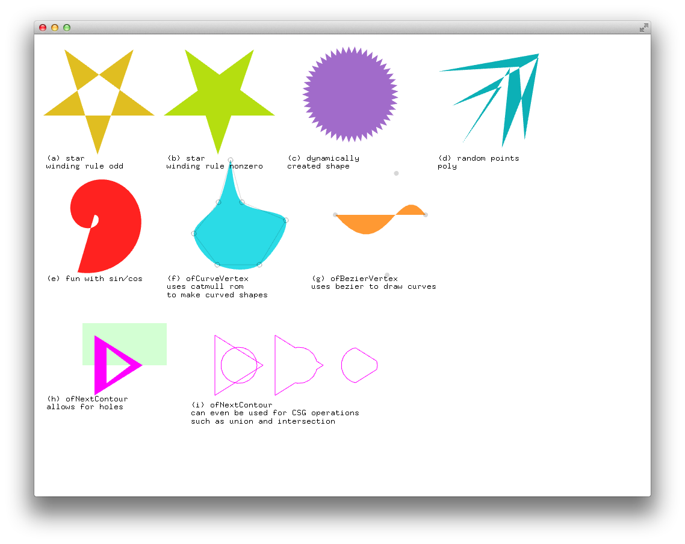

# About polygonExample




### Learning Objectives

This Example demonstrates various methods of working with polygon shapes and vertices.

This example covers the following functions:

* Different vertex types such as ofVertex, ofCurveVertex, ofBezierVertex
* Poly winding types using ofSetPolyMode
* Polygon building with ofBeginShape, ofEndShape, and ofNextContour

In the code, pay attention to: 

* Different arguments for setting the poly winding type, such as ```ofSetPolyMode(OF_POLY_WINDING_NONZERO)``` and ```ofSetPolyMode(OF_POLY_WINDING_ODD)```.
* Methods for making closed and open polygons, using ```ofEndShape()``` and ```ofEndShape(OF_CLOSE)```
* Use of the struct ```draggableVertex``` in the ofApp.h
* Changing colors with ```ofSetHexColor()```
* Creating holes and constructive geometries with ```ofNextContour()```
* Toggling of shape fills, with ```ofFill()``` and ```ofNoFill();```.
* Rendering bitmap text to the screen, with ```ofDrawBitmapString()```.

### Expected Behavior

When launching this app, you should see a screen with

* 9 differently colored polygon shapes labeled (a) through (i)
* Some bitmap text underneath each polygon shape

### Instructions for use:

* Drag the vertex points of the ofCurveVertex polygon (f) to adjust its size.

### Other classes used in this file

This Example uses no other classes.