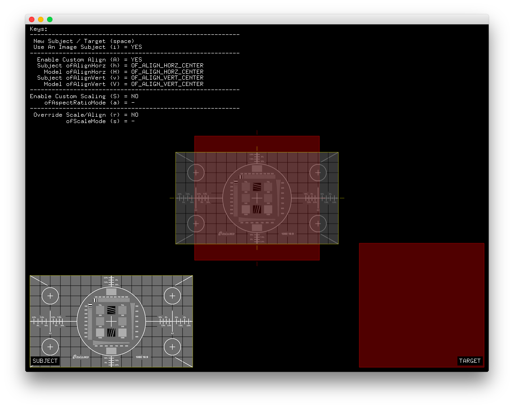

#Level2_rectangleAlignmentAndScaling
--


### Learning Objectives

This openFrameworks Example is designed to demonstrate all of the different aligning and scaling functions available in ofRectangle.  The basic premise is to define a subject and target rectangle. The "subject" (on the left) rectangle will be aligned-to and scaled-to the "target" (on the right) rectangle based on the user's input. The resulting rectangle (workingSubjectRect in this case), displayed in the center, is the result of the operations.

In this example, pay attention to the following code:

* ```ofScaleMode scaleMode``` can be interpreted as a concise combination of an ofAspectRatioMode, an ofAlignVert and an ofAlignHorz.
  *  ```OF_SCALEMODE_FILL ``` FILLS the TARGET rect with the SUBJECT rect
  *  ```OF_SCALEMODE_CENTER ``` the subject's Center is set equal to the Target's Center
  *  ```OF_SCALEMODE_FIT ``` fits the SUBJECT rect INSIDE the TARGET rect.
* ```ofAspectRatioMode``` aspect ratio is the the ratio of the width to the height of an image or screen
  * ```OF_ASPECT_RATIO_KEEP```
  * ```OF_ASPECT_RATIO_KEEP_BY_EXPANDING```
  * ```OF_ASPECT_RATIO_IGNORE```
*  ```ofAlignHorz``` aligns the subject relative to the target horizontally based on left, center, and right alignments
  *  ```OF_ALIGN_HORZ_IGNORE```
  *  ```OF_ALIGN_HORZ_LEFT```
  *  ```OF_ALIGN_HORZ_RIGHT```
  *  ```OF_ALIGN_HORZ_CENTER```
*  ```ofAlignVert```aligns the subject relative to the target vertically based on left, center, and right alignments
  *  ```OF_ALIGN_VERT_CENTER ```
  *  ```OF_ALIGN_VERT_BOTTOM ```
  *  ```OF_ALIGN_VERT_TOP```

### Expected Behavior

When launching this app, you should see:

* visual copy of the subject in the lower left hand corner
* visual copy of the target in the lower right hand corner
* working subject and target in the center of the screen
* key instructions and feedback information in the upper left hand corner

Instructions for use:

* Press key "i" to toggle using an image as the subject on and off
* Press "A" to toggle the custom alignment on and off
  * Use "h", "H", "v", and "V" to shuffle through horizontal and vertical alignment functions
* Press "S" to toggle the custom scaling on and off
  * Use "a" to shuffle through the scaling modes
* Press "r" to toggle override scale/align on and off
 * Use "s" to shuffle through the scale modes


### Other classes used in this file

This Example does not use any other classes. 
