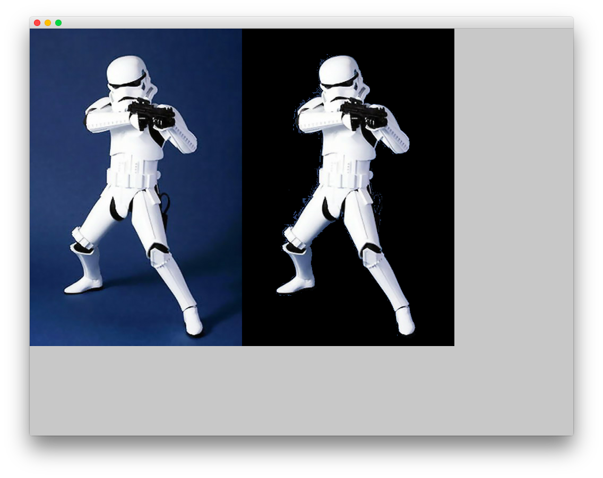

#Level1_simpleColorKey
--


### Learning Objectives

This openFrameworks Example is designed to demonstrate how to manipulate the color of specific pixels in an image. Specifically, in this example, blue is keyed out of the original image.

In this example, pay attention to the following code:

* ```original.getPixels()``` gets the pixels from the original image
* ```original.getHeight()``` & ```original.getWidth()``` gets the height and width of the original image which is used to traverse the entire image.
* While traversing the image, ```original.getColor()``` is used get the color value of each pixel using ```original.getColor()```
* ``` ofPixelsRef pixels``` copies pixels by reference rather than a full copy
*  ```keyed.setFromPixels(pixels)``` is used to set pixels to an image


### Expected Behavior

When launching this app, you should see a screen with the same image of a storm tropper twice. The first image shows a blue background, and in the second image, blue pixels have been keyed out and replaced with black pixels. 

Instructions for use:

* Press the "s" key to save the modified version.
* You will find the saved file in the bin >> data file. 


### Other classes used in this file

This Example does not use any other classes. 
