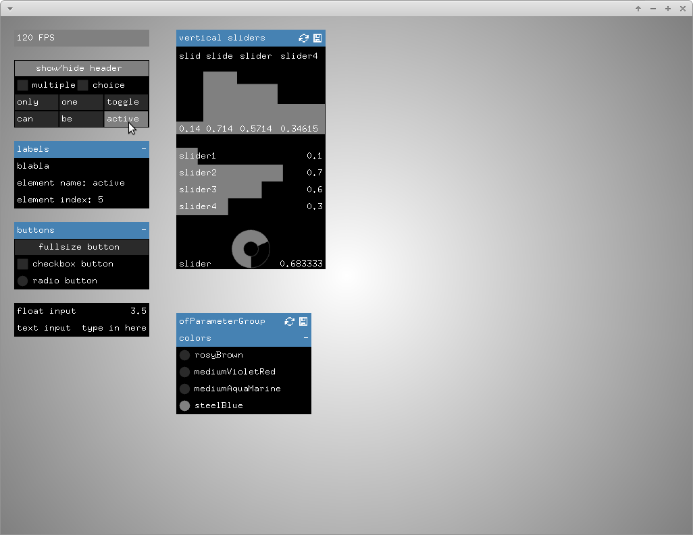

# advancedGuiExample

### Learning Objectives

This example demonstrates advanced techniques using ofxGui.

In the code, you will learn how to..
* create different button and toggle types
* set toggle groups exclusive
* create text input fields
* create vertical, horizontal and circular sliders
* set the precision of a slider
* add an FPS display
* change colors
* show and hide the header of groups and panels

### Expected Behavior

TODO

### Other classes used in this file

TODO
