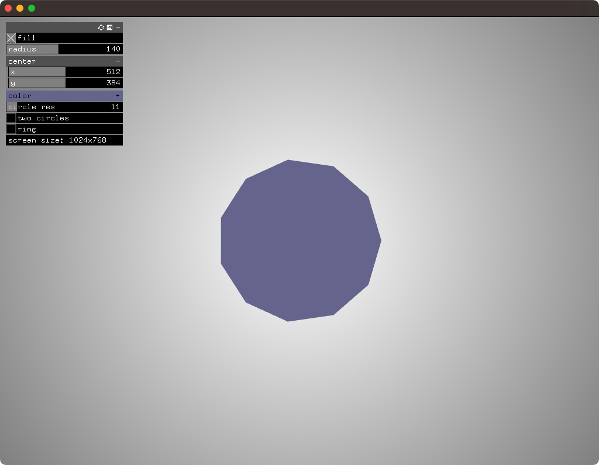

# About guiExample

### Learning Objectives
This example shows you how to use a GUI to interact dynamically with sketch parameters. It also includes the use of listeners to check for changes.

Pay special attention to the usage of `ofParameter`.

### Expected Behavior

When you open the app, you should see a screen with a hexagon and a number of sliders. Click and move the sliders to change the hexagon.

Try changing the `circle res` slider to create a circle. Try clicking the `fill` toggle.

Pressing the `h` key will hide and show the panel; spacebar sets color to white.

### Classes Used in This File

TODO

This example also uses:

	ofSoundPlayer
