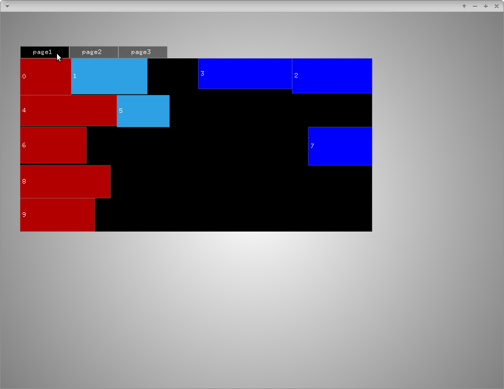

# layoutExample

### Learning Objectives

This example demonstrates methods to use layouts in ofxGui.

In the code, you will learn how to..
* create tabs and add pages
* add labels with floating behavior to a page
* set a percental with of an element

### Expected Behavior

The tabbed pages are set to always use 70% of the window. If you resize the window, the layout will change. Be aware that the layout is redone everytime you change the window size so dragging the edges of the window can lead to temporary freezes until the new layout is computed. This will be worse for page 3 containing the biggest amount of elements.

### Other classes used in this file

TODO
