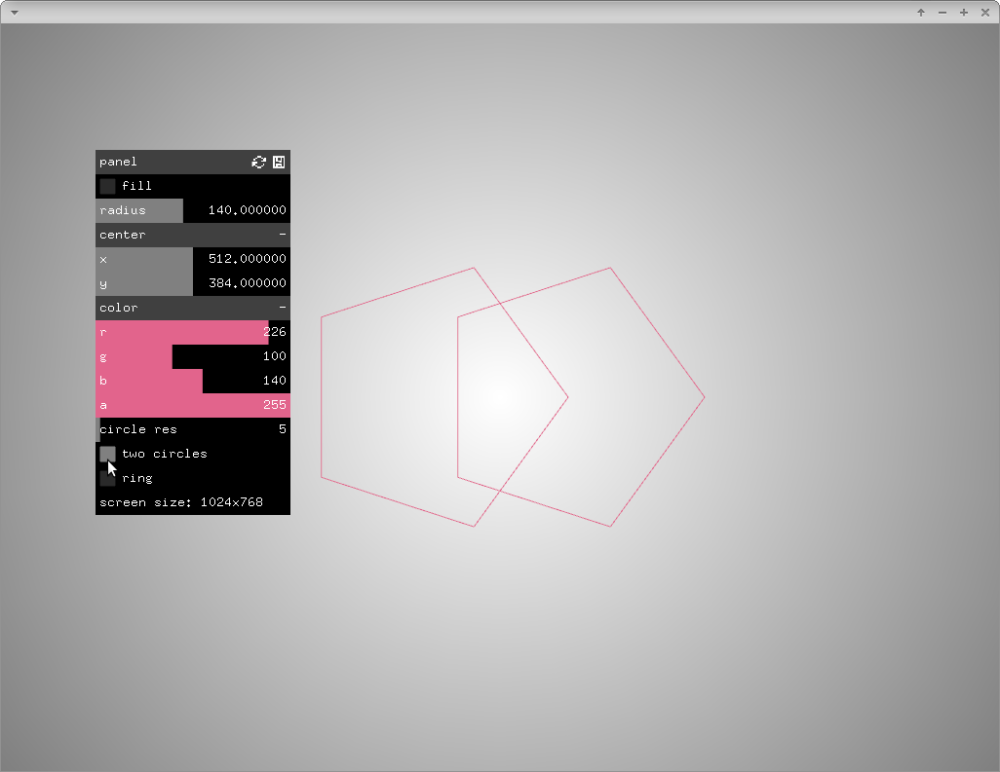

# About badPracticeGuiExample

### Learning Objectives
This example is similar to `guiExample`. It uses pointers to gui elements instead of `ofParameter`. This is not advised and this example could be deleted though we could keep it in case someone asks _"I want to store buttons and toggles and sliders and use them to do math"_. We can answer _"Sure, have a look at the badPracticeGuiExample."_. Which is probably why you are here. Go to `guiExample` and learn how to use `ofParameter`, you won't regret it.

### Expected Behavior

When you open the app, you should see a screen with a hexagon and a number of sliders. Click and move the sliders to change the hexagon.

Try changing the `circle res` slider to create a circle. Try clicking the `fill` toggle.

Pressing the `h` key will hide and show the panel; spacebar sets color to white.

### Classes Used in This File

TODO

This example also uses:

	ofSoundPlayer
