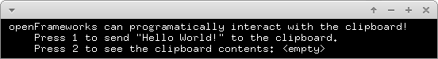

# clipboardExample



### Learning Objectives

This example demonstrates how to access clipboard content. It teaches you the use of the following functions:
* ```ofGetWindowPtr()->getClipboardString()```
* ```ofGetWindowPtr()->setClipboardString(std::string)```

### Expected Behavior

When launching this app, you should see a screen with instructions on how to access the clipboard content.

Instructions for use:

* Press ```1``` to send "Hello Works" to the clipboard
* Press ```2``` to show the clipboard content

### Other classes used in this file

This Example uses no other classes.
