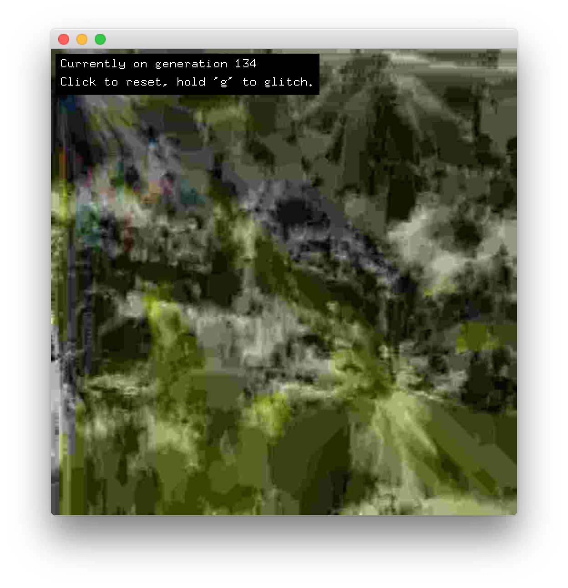

# About imageCompressionExample




### Learning Objectives

This example demonstrates how to set the image quality when saving an image, and how to affect the quality by resizing the image through multiples passes. 

In the code, pay attention to: 

* Use of ```img.save(curFilename, quality);``` to save an image with a particular quality setting
* Use ```img.resize``` to resize the image
* Accomplishing a glitch effect by using ```ofBufferFromFile``` to load and manipulate the bytes
* The enumerators for image quality type including ```OF_IMAGE_QUALITY_BEST```,
    ```OF_IMAGE_QUALITY_HIGH```,
    ```OF_IMAGE_QUALITY_MEDIUM```,
    ```OF_IMAGE_QUALITY_LOW```,   
    ```OF_IMAGE_QUALITY_WORST```
 
### Expected Behavior

When launching this application you will see: 

* An image that is being continually resized
* A black overlay on the image that indicates the number of resizing passes, as well as instructions for resetting and glitching the image.

When the ```g``` is pressed: 

* the image will be randomly "glitched" 

When the image is clicked on:

* The process of resizing will restart from the beginning, resetting the image. 

Instructions for use:

* Press ```g``` to glitch the image
* Click on the image to reset the image and restart the resampling process


### Other classes used in this file

This Example uses no other classes.