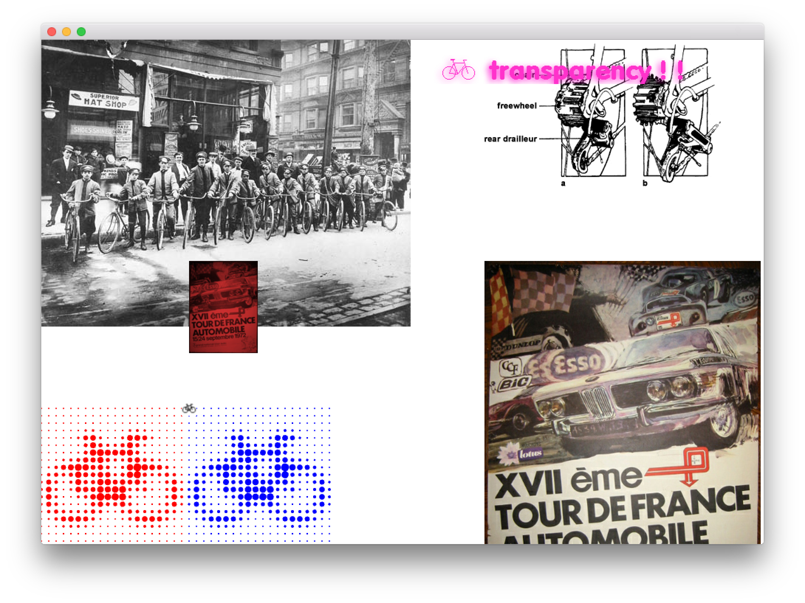

# About Image Loader Example

--


### Learning Objectives

This openFrameworks Example is designed to demonstrate
how to load image files.

In this example, pay attention to the following code:

* Creating an image object using the OF type ofImage, ```ofImage imageName```
* Loading your image, ```imageName.load("INSERT FILE PATH HERE")```
* Drawing your image, ```imageName.draw(xPosition, yPosition)```
* Returns a raw pointer to the pixel data, ```imageName.getPixels()```
* Getting the color of your image at a specific pixel position, ```imageName.getColor(xPosition, yPosition)```


### Expected Behavior

When launching this app, you should see:

* a screen with a variety of different images,
* pink transpart image will be oscillating back and forth on a small part of the screen

Instructions for use:

* There is no user interaction with this sketch.


### Other classes used in this file

This Example uses no other classes.
