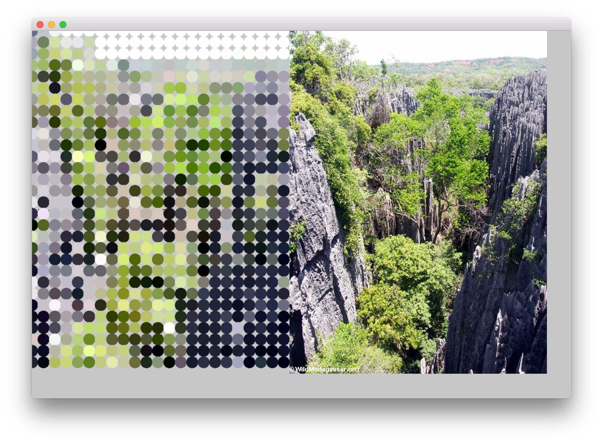

# About Image Loader Web Example

--


### Learning Objectives

This openFrameworks example demonstrates how to load an image from the web and then apply a pointillism effect to the image.  

In this example, pay attention to the following code:

* Request to load an image using ```ofLoadURLAsync``` which passes the url, and a name for the request 
* Handle the response from the request using ```void ofApp::urlResponse```
* Determine information about the fullfilled request by inspecting the status code ```response.status``` and the request name ```response.request.name```
* On exit of the application, unregister the application from being notified of the URL request completion using ```ofUnregisterURLNotification```
* Load the data from the request into an image holder using ```img.load(response.data)```
* Inspect the pixel information of the image to draw a pointillism effect leveraging ```img.getColor(x,y)``` , ```ofSetColor``` and ```ofDrawCircle```


### Expected Behavior

When launching this app, you should see:

* a gray screen 
* instructions to hit the spacebar to load the image

Instructions for use:

* Press the ```spacebar``` to make the load request for the image

When the image is loaded, the pointillism effect will be created on the left hand side. Moving your mouse around will affect the size of the circles used to create the effect.


### Other classes used in this file

This Example uses no other classes.
