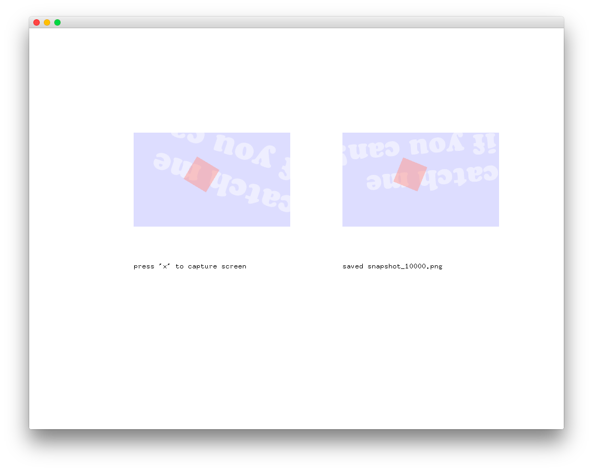
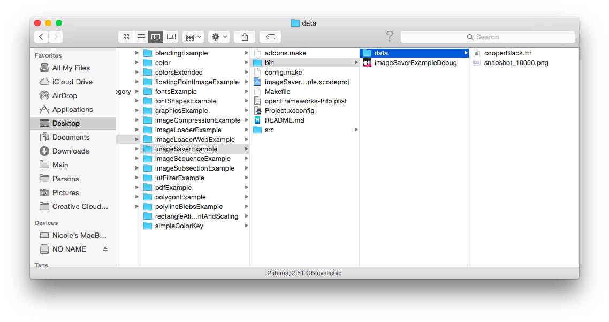

#level1_imageSaverExample
--


### Learning Objectives

This openFrameworks Example is designed to demonstrate how to save a screenshot of a specific area of your output screen.

In this example, pay attention to the following code: 

* Creating an image object using OF data type ofImage, ```ofImage img```
* Grab a rectange at point (x,y) using the width and height that is passed through, ```img.grabScreen(x, y, width, height) ```
* Save the screenshot, ```img.save("INSERT FILE NAME HERE") ```
* Draw the screenshot at point (x,y) using the width and height that is passed through, ```img.draw(x, y, width, height) ```


### Expected Behavior

When launching this app, you should see:

* a screen with a light blue rectangle that has rotating text and red rectangle within it
* a command to press x to capture the screen

Instructions for use:

* Press "x" to capture the screen.
* After pressing "x", you will see the saved image file adjacent to the original drawing with the name of the file directly below.
* You can find the saved file in bin >> data: 



### Other classes used in this file

This Example uses no additional classes.


