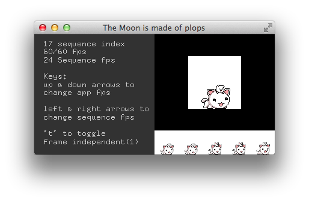

# About imageSequenceExample




### Learning Objectives

This example demonstrates loading a sequence of images from a folder. For this demonstration, we know that the images are in order and the we saved them out at 24fps. The goal is to play them back at 24fps independent of the FPS of the app.
 
You can toggle the sequence to be independent of the app FPS.

This example covers the following topics:

* ofDirectory
* ofImage
* timing

In the code, pay attention to: 

* Loading all files from a directory with the functions ```dir.listDir()``` and ```dir.getPath()```
* Loading files into a vector of images 
* Setting independent frame timing based on the app time and the desired sequence fps, and using modulus (```%```) to wrap to the correct frame index:  ```frameIndex = (int)(ofGetElapsedTimef() * sequenceFPS) % images.size();```
* Using ```ofGetFrameNum()``` and modulus (```%```) to wrap to the current index in app-synced mode: ```frameIndex = ofGetFrameNum() % images.size();```
* Logging errors if directories or files do not exist


### Expected Behavior

When launching this app, you should see a small window split vertically. 

The left side displays bitmap text with information about FPS, sequence FPS, and sequence index. There is also bitmap text with instructions for key control of the demo app.

The right side displays a hero image of the current frame with a series of 5 adjacent frames underneath. The frame should be automatically sequencing through an animation.

### Instructions for use:

The following key commands will change the behavior of the animation:

* 't' toggles the animation FPS to sync with the app framerate vs. running at an independent framerate
* up and down arrows change the app frame rate
* left and right arrows change the independent animation framerate

### Other classes used in this file

This example uses no other classes.