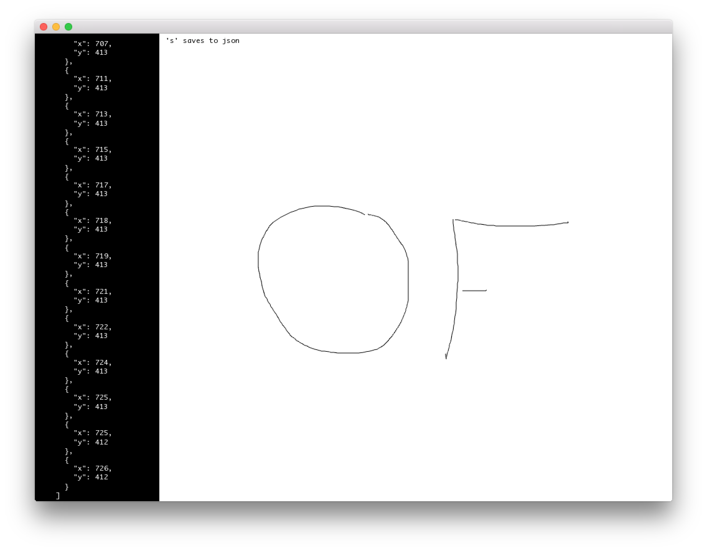

# About jsonExample




### Learning Objectives

This example demonstrates how to read and write a json file to the file system leveraging ```ofJson```. 

In the code, pay attention to: 

* Use ```ofJson``` to read a json file from the file system with ```ofFile file("drawing.json");```
* Checking to see if the file exists with ```file.exists()```
* Writing a json file to the file system with ```ofFile file("drawing.json", ofFile::WriteOnly);```


### Expected Behavior

When launching this app for the first time, you will see a screen with:

* Two sections with the one on the left being black and will report the JSON being created and the larger one on the left being the white drawing canvas. 

When the mouse is pressed, the application : 

* starts to record the drag movement. 
* As the mouse is dragged across the canvas, the path is drawn in a thin stroke to the canvas.
*  Drag coordinates are captured in a json structure that can be saved as a file. 

When the key ```s``` is pressed:

* The application will save the stored json data structure into the ```data\drawing.json``` file. 

Instructions for use:

* Press down on the canvas with the mouse and start dragging the mouse while holding down. 
* Press ```s``` to save the json file of the current state to a local json file
* Restart the application to see the saved settings of the last drawn recording restored. 


### Other classes used in this file

This Example uses no other classes.