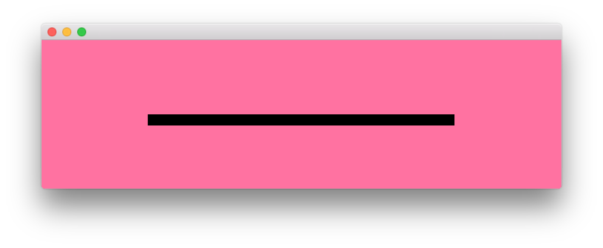

# About loadTextFileExample




### Learning Objectives

This example demonstrates how to load in a text file and then read it line by line easily utilizing a typewriter effect. 

In the code, pay attention to: 

* Use of ````ofBufferFromFile()```` to read in a text file into a ````ofBuffer````
* Use of ```` ofBuffer.getLines().begin()```` and ````ofBuffer.getLines().end()```` to determine the beginning and the total number of lines 


### Expected Behavior

When launching this application you will see:
* A window with a background of bright pink and a black bar in the middle
* Text that has been loaded in and is revealed on an interval using a typewriter effect

 
Instructions for use:

* Running the application will start the animation of the text being revealed


### Other classes used in this file

This Example uses no other classes.