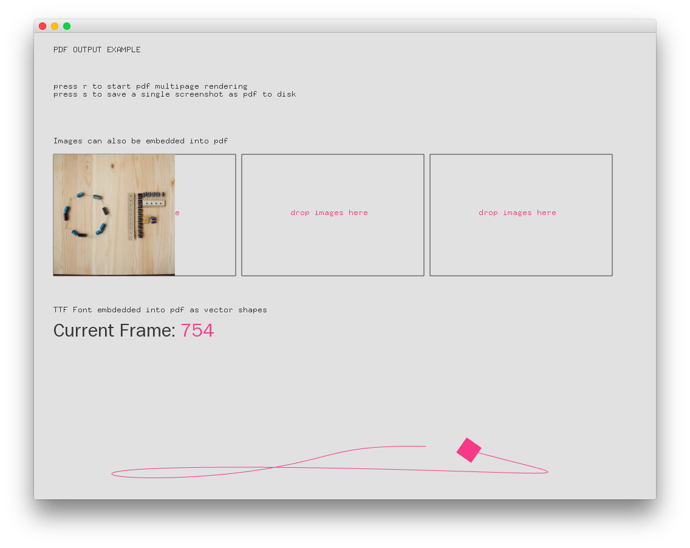

#Level2_pdfExample
--


### Learning Objectives

This openFrameworks Example is designed to demonstrate how to save PDF versions of an OF app output.  

In this example, pay attention to the following code:

* ```ofBeginSaveScreenAsPDF(...) ``` outputs PDF file based on the following parameters that are passed through: 
  * string filename, 
  * bool bMultipage, 
  * bool b3D, 
  * ofRectangle outputsize
* ```ofEndSaveScreenAsPDF(...) ```


### Expected Behavior

When launching this app, you should see:

* 3 same sized rectangles as image holders; the first image autopopulates with an OF image
* the other two rectangles are areas to drag and drop your own images in
* Counter for the framerate
* Moving box and box trail

Instructions for use:

* Press 'r' to save a multi-page PDF file
* Press 's' to save a one-page, screenshot PDF file
* Drag and drop images into the recetangles with "drop images here" command 


### Other classes used in this file

This Example does not use any other classes. 
