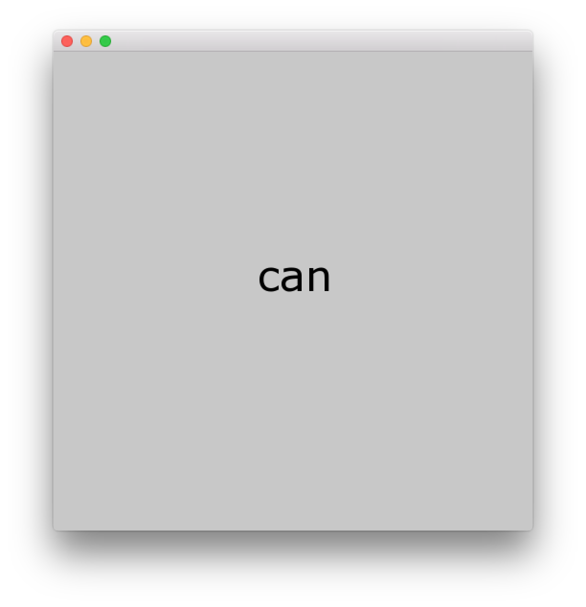

# About systemSpeakExample




### Learning Objectives

This example demonstrates how to invoke a system level command on Windows or OS and in this particular example, to "say" the word. 

In the code, pay attention to: 

* Creation of command which differs for the OS ```cmd = "say -v "+voice+" "+words[step]+" "; ``` for OSX and ```string cmd = "data\\SayStatic.exe "+words[step]; ``` for Windows
* Use ```system(cmd.c_str());``` to invoke the command
* Loading of text file and getting contents using ```ofBufferFromFile("lyrics.txt").getText();```


### Expected Behavior

When launching this app you will get a gray screen with:

* The current word being spoken show in black text in the middle of the screen
* The current word changing as it cycles through the entire loaded text 


When the key ```r``` is pressed:

* The application will toggle between selecting a random voice from the list of system voices or the default. 

Instructions for use:

* Run the application and let it play through the text. Press the ```r``` key to select a random voice. 


### Other classes used in this file

This Example uses no other classes.