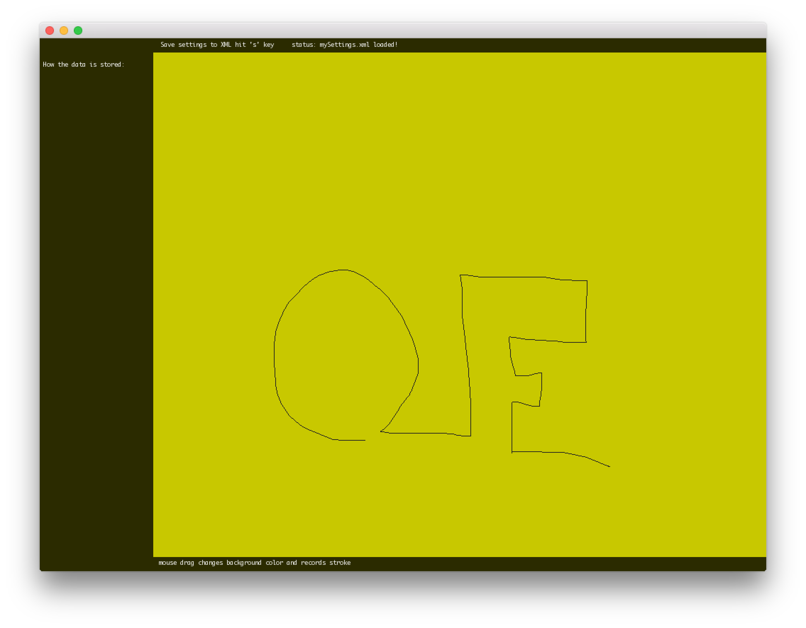

# About XMLExample




### Learning Objectives

This example demonstrates how to read and write an xml file to the file system leveraging ```ofXML```. 

In the code, pay attention to: 

* Use ```ofXML``` to read an xml file from the file system with ```XML.load("mySettings.xml")```
* Writing an xml file to the file system with ```XML.save("mySettings.xml")```

* Adding childNodes to the xml with ```XML.addChild``` and appending with ```XML.addXML```
* Parsing and traversing XML with ```XML.exists()```, ```XML.getValue()```, ```XML.setToSibling()```,```XML.setToParent()```, ```XML.setTo()```,```XML.getName()``` 


### Expected Behavior

When launching this app for the first time, you will see a screen with:

* A black background, with a thin column on the left and a large filled rect on the right
* Text instructions at the top and at the bottom of the screen. 
* A line drawn on the right canvas 

When the mouse is pressed, the application : 

* starts to record the drag movement. 
* As the mouse is dragged across the canvas, the path is drawn in a thin stroke to the canvas.
* The background will changing color randomly with mouse movement
*  Drag coordinates, along with the background color are captured in an xml structure while dragging

When the key ```s``` is pressed:

* The application will save the stored xml data structure into the ```data\mySetttings.xml``` file. 

Instructions for use:

* Press down on the canvas with the mouse and start dragging the mouse while holding down. 
* Press ```s``` to save the xml file of the current state to a local xml file
* Restart the application to see the saved settings of the last drawn recording restored. 


### Other classes used in this file

This Example uses no other classes.