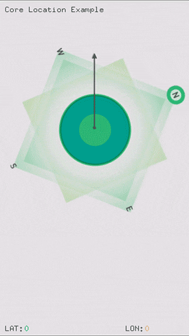

# About coreLocationExample

### Learning Objectives

This Example demonstrates using the native CoreLocation Apple SDK to understand your device's general cardinal direction.

After studying this example, you'll understand how to grab the CoreLocation information from your device, and use it to rotate an image in your application for immediate feedback within the interface.

In the code, pay attention to:

* The initialization of and use of the ``ofxiOSCoreLocation`` object.
* ``startHeading()`` and ``startLocation()`` methods of the ``ofxiOSCoreLocation`` object are called in the ``setup()``, telling native Apple SDKs to begin sending you the device's details.
* ``getTrueHeading()``, ``getLatitude()``, and ``getLongitude()`` methods of the ``ofxiOSCoreLocation`` bring back fun and useful geo-spatial data, used in both the ``update()`` and ``draw()`` events.

### Expected Behavior

When launching this app, you should see a screen with:

* A compass-like visual interface that rotates with your movement throughout space.

Instructions for use:

* Move around, point your device at your nearest landmark, and note its cardinal direction.

### Other classes used in this file

This Example uses the following classes:

* [ofxiOS](http://openframeworks.cc/documentation/ofxiOS/) (for compiling openFrameworks to an Apple iOS device)
* ofxiOSCoreLocation
