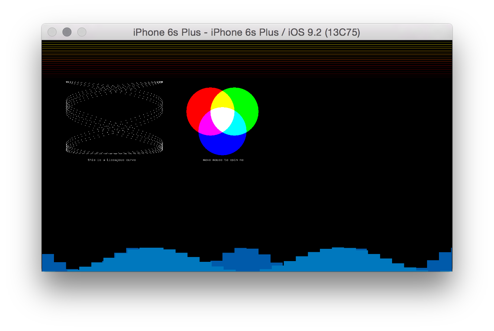
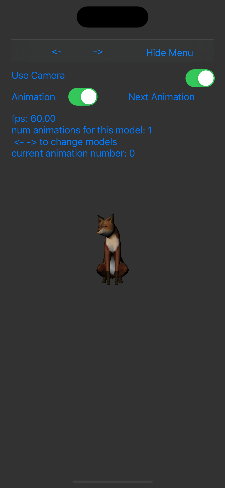

# About <This Section>

--

### Learning Objectives

This section of examples aims to provide understanding around the topic of <insert topic> and some examples of use...

### Table of Contents

* [advancedEventsExample](advancedEventsExample/) - Custom Events in iOS
* [advancedGraphics](advancedGraphics/) - Advanced Graphics (Lissa Jous, etc)
* [assimpExample](assimpExample/) - Loading 3D Models that can animate in a 3D space
* [audioInputExample](audioInputExample/) - Handling incoming audio signal
* [audioOutputExample](audioOutputExample/) - Create sounds for an iOS application

...

### At a Glance

)
([advancedEventsExample](advancedEventsExample/))

([advancedGraphics](advancedGraphics/))

([assimpExample](assimpExample/))
