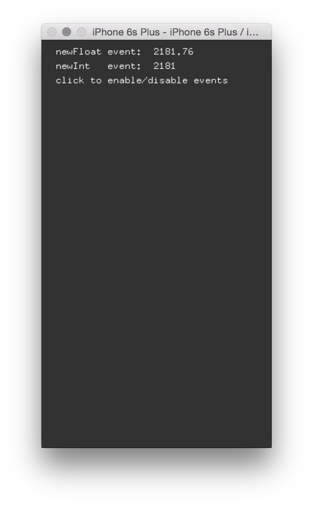

# About advancedEventsExample



### Learning Objectives

This Example demonstrates how you can register custom events in openFrameworks, in an iOS application.

After studying this example, you'll understand how to create an event object, and bind events to it.

In the code, pay attention to:

* The custom object ```eventsObject``` and its corresponding ```newFloatEvent()``` and ```newIntEvent()```.
* ```ofAddListener```, which allows you to bind the events in the custom ```eventsObject``` to methods in your ```ofApp.mm```
* The touchEvent allows you to toggle these custom events on and off.

### Expected Behavior

When launching this app, you should see a screen with

* Instructional Text
* After tapping, you can toggle on/off event information which is drawn to the screen every time the custom events are triggered.

Instructions for use:

* Tap the screen to toggle whether or not the events are triggered (and thereby drawn on screen).

### Other classes used in this file

This Example uses the following classes:

* [ofxiOS](http://openframeworks.cc/documentation/ofxiOS/) (for compiling openFrameworks to an Apple iOS device)
* ofEvents (for ofEventArgs and ofEvents)
