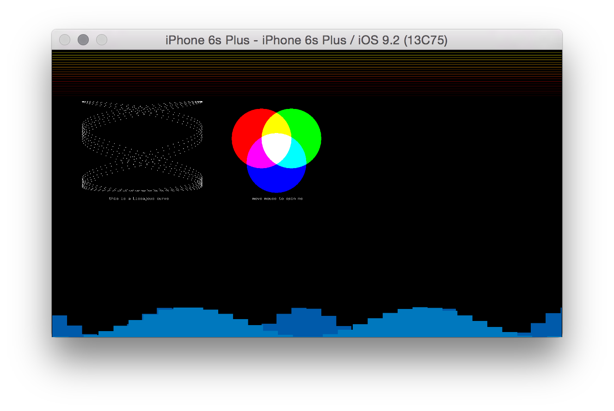

# About advancedGraphicsExample



### Learning Objectives

This Example demonstrates advanced graphics capabilities of openFrameworks in an iOS application.

After studying this example, you'll understand how to render some simple colored lines and elementary shapes, such as ellipses and rectangles, along with more complicated shapes like the [Lissa Jous Curve](http://en.wikipedia.org/wiki/Lissajous_curve).

In the code, pay attention to:

* Different section within the draw loop define different elements drawn on screen.
* ```ofScale``` in the draw loop provides a mechanism for drawing a different sizes for different types of devices (retina vs. non-retina).

### Expected Behavior

When launching this app, you should see a screen with:

* Lines spanning the full width of the screen.
* A Lissa Jous Curve.
* Three Ellipses with Blend Mode.
* Pixelated Wave at the bottom of the screen.

Instructions for use:

* Tap and drag to interact with the curve and ellipse shapes.

### Other classes used in this file

This Example uses the following classes:

* [ofxiOS](http://openframeworks.cc/documentation/ofxiOS/) (for compiling openFrameworks to an Apple iOS device)
