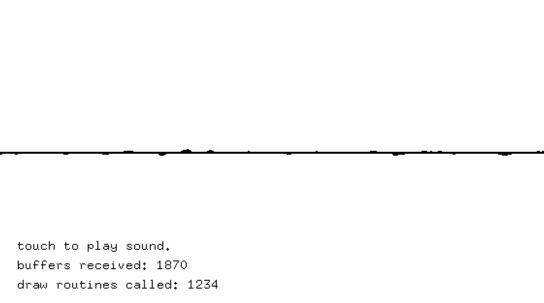

#audioInputExample
--


### Learning Objectives

This openFrameworks example is designed to demonstrate how to access, extract, and draw from your audio input's raw data.

Studying the code behind this example will help you understand:

* How audio functions work independent from draw and update loop by observing the ```audioIn``` event.
* How raw audio information can be saved to a ```buffer``` array over time.


### Expected Behavior

When launching this app, you should see

* Raw visual output of the audio buffer captured in the ```buffer``` array.
* Text that shows size of the buffer along with the count for the ```audioIn``` event.

Instructions for use:

* make some noise or touch your microphone to see how sound manipulate the drawing.
* touch and hold the screen to turn up the volume


### Classes used in this example

This Example uses the following classes:

* [ofxiOS](http://openframeworks.cc/documentation/ofxiOS/) (for compiling openFrameworks to an Apple iOS device)
* ``ofSoundPlayer``
* ``ofSoundStream``
* ``ofSoundStreamSettings``
