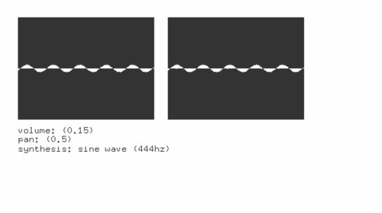

#audioOutputExample
--


### Learning Objectives

This openFrameworks example is designed to demonstrate how to play loaded sounds in your iOS application.

Studying the code behind this example will help you understand:

* How audio functions work independent from draw and update loop by observing the ```audioOut``` event.
* How raw audio information can be saved to a ```buffer``` array over time.
* How to create sounds with data rather than pre-rendered sound assets.


### Expected Behavior

When launching this app, you should see

* Raw visual output of the audio buffer in the ```buffer``` array.
* Text that shows information about the sound data and the mode uses in the ```audioOut``` event.

Instructions for use:

* turn up your device's volume to hear sounds generated by the application.
* touch and hold the screen to produce noise into the sound buffer


### Classes used in this example

This Example uses the following classes:

* [ofxiOS](http://openframeworks.cc/documentation/ofxiOS/) (for compiling openFrameworks to an Apple iOS device)
* ``ofSoundStream``
* ``ofSoundStreamSettings``
