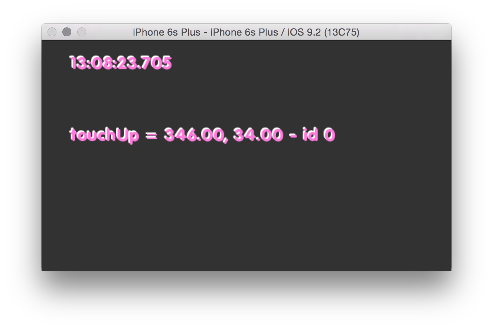

# About allEventsExample




### Learning Objectives

This Example demonstrates the touch events and orientation event.

After studying this example, you'll understand how to trigger events and retrieve information from events when the screen is touched by one or more fingers, or when the devices is rotated by the user.

In the code, pay attention to:

* Different commands to access the current time information: ```ofGetTimestampString()``` and ```ofGetElapsedTimeMillis()```
* Access touches information:
*							```touchMoved(ofTouchEventArgs & touch)```
*							```touchDown(ofTouchEventArgs & touch)```
*							```touchUp(ofTouchEventArgs & touch)```
*							```touchDoubleTap(ofTouchEventArgs & touch)```
*							```touchCancelled(ofTouchEventArgs & touch)```
* Access information about the device orientation changing: ```deviceOrientationChanged(int newOrientation)```


### Expected Behavior


When launching this app, you should see a screen with

* a text display of the current time, the elapsed time in milliseconds, the current event being triggered


Instructions for use:

* Touch the screen to see how their corresponding labels are displayed. Rotate the device to see orientation events trigger.


### Other classes used in this file

This Example uses the following classes:

* [ofxiOS](http://openframeworks.cc/documentation/ofxiOS/) (for compiling openFrameworks to an Apple iOS device)
