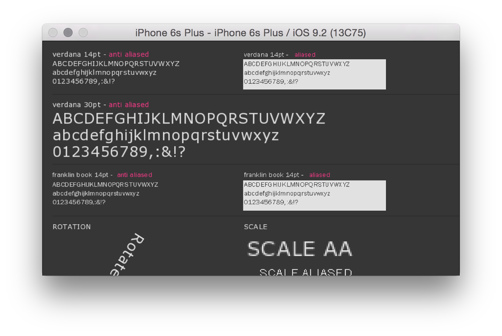

# About fontsExample



### Learning Objectives

This example demonstrates basic methods of drawing strings and characters using TrueType font, as well as determining the bounding box size of the text to be rendered with that font. In this demonstration, text is drawn in a variety of environments. Additionally, the ```getStringBoundingBox()``` method is used to return an ```ofRectangle``` that can help you further align your text within the application.

This example covers the following functions:

* ofTrueTypeFont as a data type
* ````drawString()```
* ```getStringBoundingBox()```

In the code, pay attention to:

* Various techniques utilized to position and move the text as applied through a font.

### Expected Behavior

When launching this app, you should see a gray screen with white and pink text displaying a variety of characters and text. The large individual characters should update when the screen is touched/dragged, and the bottom rows of text should display strings in bitmap and vector.

### Instructions for use:

* Watch and behold the magic of rendered fonts on your mobile device.

### Other classes used in this file

This Example uses the following classes:

* [ofxiOS](http://openframeworks.cc/documentation/ofxiOS/) (for compiling openFrameworks to an Apple iOS device)
