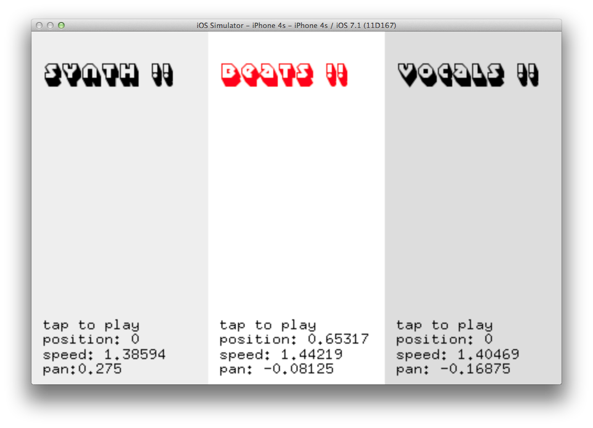

# soundPlayerExample

### Learning Objectives

This openFrameworks example demonstrates how to load audio files, play sounds interactively and how to manipulate their pan and playback speed.

Studying this example will help you understand:

* how to use ``ofSoundPlayer`` to play sounds, and how to use its helpful functions, e.g.:
  * ``load()`` to load a sound file.
  * ``play()`` to play a sound file.
  * ``setSpeed()``, ``setPan()``, ``setVolume()`` do what you would expect them to.
  * ``setMultiPlay()`` to play the sound file more than once at the same time (if set to true).
* how ``ofSoundUpdate()`` is called in ``update()`` to  update the sound playing system.
* how to use ``ofMap()`` to map values to a different range.
* how to allow the user to interact with the app in ``touchMoved()`` and ``touchDown()``.

### Expected Behavior

You should see the window separated into three sections: synth, beats, and vocals. Tapping on each section should play a sound file – depending on your finger position it will play the sounds at varying speeds and pitches.

Instructions for use:

* Tap in the left area to play the synth sound file. The x-position of where you tapped should change the pan, the y-position changes the speed.
* Tap in the center area to play the beats. Tap and move up and down to change the playback speed.
* Tap in the right area to play the vocals. These are set to multiplay, so you can play them at varying speeds several times at once.

### Classes used in this example

This example uses the following classes: 

* ``ofSoundPlayer``