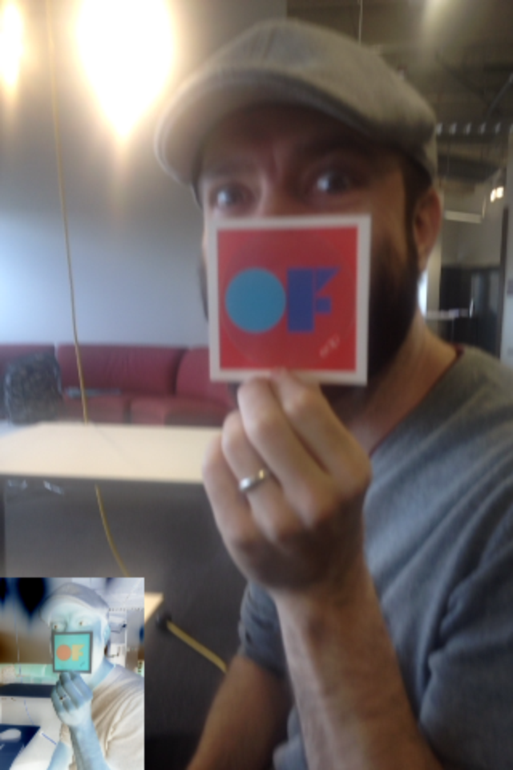

# videoGrabberExample

### Learning Objectives

This openFrameworks example is designed to demonstrate how to access the camera on your phone.

Studying this example will help you understand:

* how to initiate ``ofVideoGrabber``
* how to allocate memory on your graphics card for ``ofPixels``
* how to iterate through the camera's frame's pixels (by accessing its ``ofPixels``)
* how to manipulate the camera image / how to invert an image

### Expected Behavior

You will see the fullscreen camera image as well as an inverted version of the camera stream in a small window on the left.

### Classes used in this example

This example uses the following classes: 

* ``ofVideoGrabber``
* ``ofPixels``