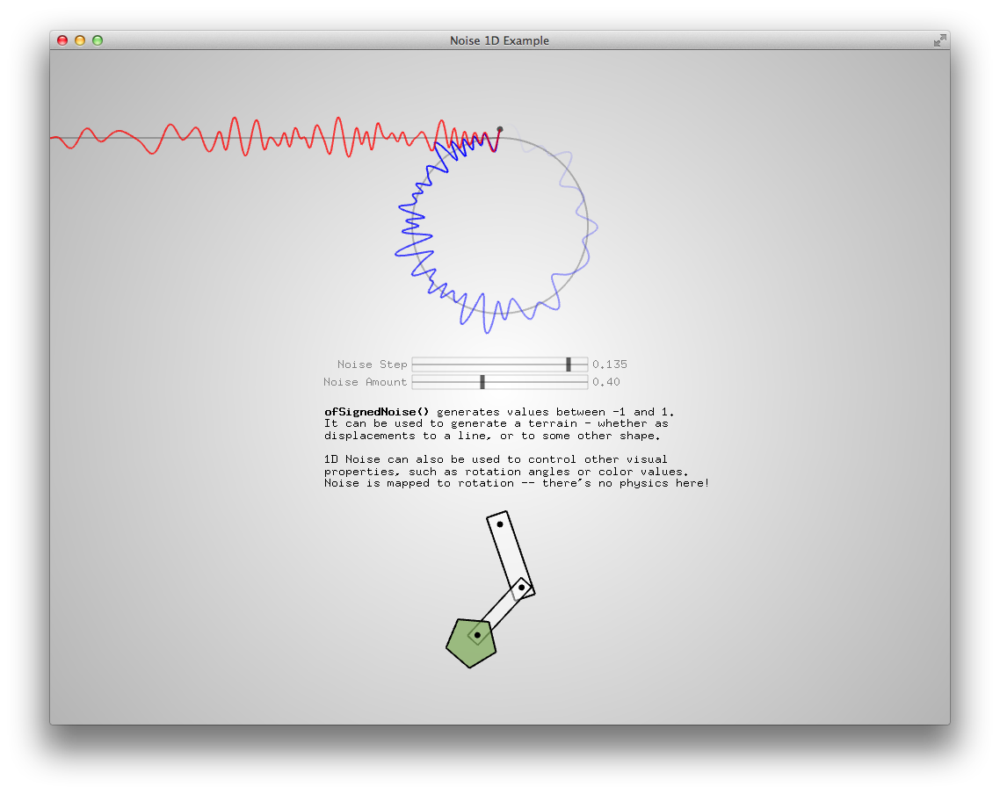

# About noise1dExample

### Learning Objectives

This Example demonstrates various parameters of one-dimensional ofSignedNoise, a Perlin noise calculator. The example demonstrates control of different properties of noise, shown in linear and radial line graphs, rotation angle control of a simple robot, and color modulation.

This example is intended to show several possible outcomes of the ofSignedNoise function (ranging from linear terrain to angular motion to color) and is not intended as a basic introduction to noise. 

Sliders in the main window control the step (resolution) and amount (amplitude) of the noise calculation.

### Expected Behavior

When launching this app, you should see a screen with

* A red noisy wave advancing to the left
* A blue noisy wave advancing around a circle
* Sliders labeled "Noise Step" and "Noise Amount"
* Bitmap text explaining the ofSignedNoise() function

### Instructions for use:

* Drag the sliders to the left and right to control different noise properties.

### Other classes used in this file

This Example uses ofxSimpleSlider for the property sliders.