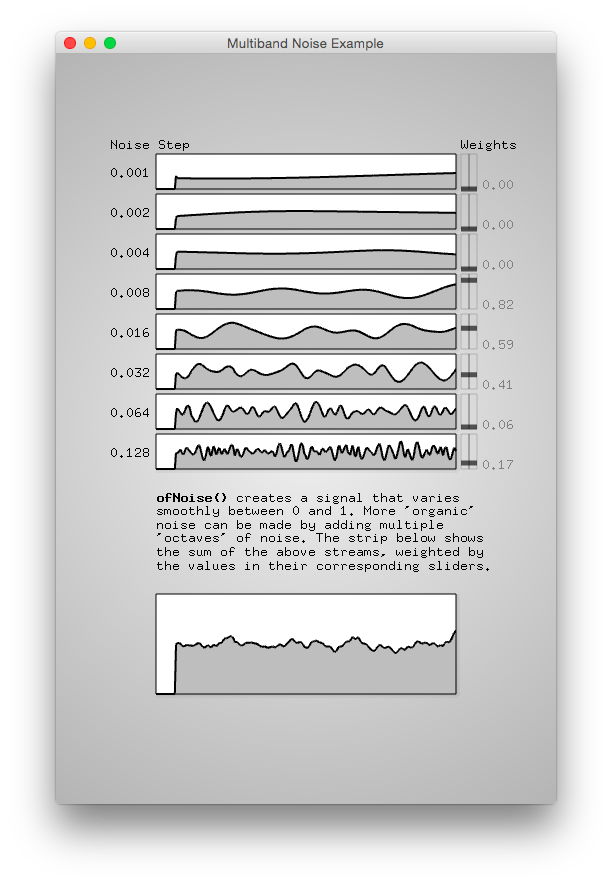

#level2_noise1dOctaveExample
--


### Learning Objectives

This openFrameworks Example is designed to demonstrate how more "organic" noise signals can be generated by summing multiple ["octaves"](http://freespace.virgin.net/hugo.elias/models/m_perlin.htm) of noise. 

In this example, pay attention to the following code: 

*   ```ofNoise()``` creates a signal that varies smoothly between 0 and 1. More 'organic' noise can be made by adding multiple 'octaves' of noise. Each noise function that is added to the final strip is an 'octave'.
*    ```struct NoiseDataStrip {}```, struct is a data structure that can have a number of data elements grouped together. In this app, "NoiseDataStrip" (in ofApp.h) is a simple struct  to store the data contained by one of these noise recordings. Each struct contains the bounding coordinates (x,y,w,h), and some other parameters, plus the float array (data) containing the noise recordings.
*  ```void setupMultibandNoiseDemo()``` used to setup and allocate resources used in the multi-noise strip demo
*  ```void updateMultibandNoiseDemo()``` this is where the data for each strip is updated, ofNoise() is called, normalization factor is computed, and each strip is summed and normalized 
* ```void render1DNoiseStrip (...)``` renders  each individual strip
* ```void renderMultibandNoiseDemo()``` is where ```void render1DNoiseStrip (...)``` is called for each strip, rendering each strip simultaneously 

### Expected Behavior

When launching this app, you should see:

* 8 graphs or 'strips' of the noise function will appear each with different noise step value and a weight value that can be controlled with the slider
* the bottom graph is the sum of each strip, weighted by the values controlled by the slider

Instructions for use:

* Move the slider to the right of each strip to control the weighted value which affects the bottom summed graph. Each graph that is added is considered an 'octave' 

### Other classes used in this file

This Example uses "ofxSimpleSlider" to add sliders to the final outpout. 


