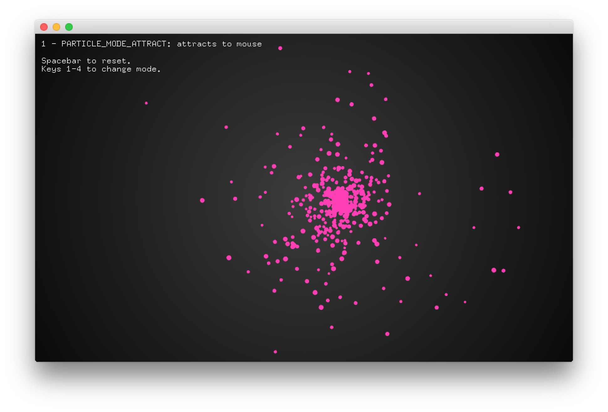

# About Particles Example
--


### Learning Objectives

This openFrameworks example is designed to illustrate and explore particle systems and some of their behaviours for interactivity such as attraction and repulsion. 

In this example, pay attention to the following code: 

* Use of ```ofSetVerticalSync``` to synchronize the redraw of the screen to the vertical refresh of your screen 
* ```p.assign(num, demoParticle());``` which creates a vector with the length of num, of type demoParticle to store reference to all the particles

* ```void ofApp::resetParticles``` which resets the particle system and the mode of behaviour along with the attraction points which are randomly generated 
* ```void ofApp::update``` to update the the particles, along with modifying the attraction points to create some natural movement. 
* ```ofSignedNoise``` for [natural random motion](https://github.com/openframeworks/openFrameworks/issues/1133) to create attraction points for the particle system that are more organic
* ```void ofApp::draw()``` to ask the particles to draw, and draw the attraction points of area and colors 
* Switching of particle modes in the ```keyPressed``` method based on key input, which is then applied and updated in ```update``` method.

### Expected Behavior

When launching this app, you should see:

* A black screen with colored particles that will swarm and be attracted towards the mouse as the initial particle system state is ```PARTICLE_MODE_ATTRACT```
* Instructions for keys that will affect the particle mode including ```PARTICLE_MODE_ATTRACT```, ```PARTICLE_MODE_REPEL```,```PARTICLE_MODE_NEAREST_POINTS``` and ```PARTICLE_MODE_NOISE```

Instructions for use:

* Press the ```1``` key to change the particle system mode to ```PARTICLE_MODE_ATTRACT```
* Press the ```2``` key to change the particle system mode to ```PARTICLE_MODE_REPEL```
* Press the ```3``` key to change the particle system mode to ```PARTICLE_MODE_NEAREST_POINTS```
* Press the ```4``` key to change the particle system mode to ```PARTICLE_MODE_NOISE```
* Press the ```spacebar``` to reset the particle systems and mode to its original state

### Other classes used in this file

This Example uses "demoParticle" for the particle system. 


