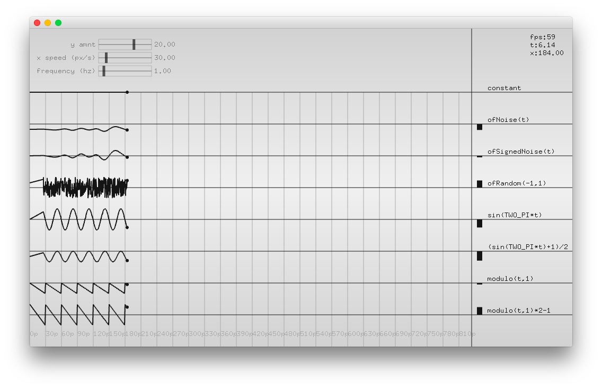

#level1_periodicSignalsExample
--


### Learning Objectives

This openFrameworks Example is designed to demonstrate how to draw a variety of [periodic signals](periodicSignalsExample), a signal that completes a pattern within a measurable timeframe using one of the following: trig functions, modulo, ofRandomn, or a varient of the noise function. 

In this example, pay attention to the following code: 

* [Trig function](https://en.wikipedia.org/wiki/Trigonometric_functions) ```sin(angle)``` that uses angles and returns values between -1 and 1 (see the trigonometryExample for more on trig functions)
*  ```ofNoise()```, calculates a randomn value between 0 and 1.0 based on [perlin noise](https://en.wikipedia.org/wiki/Perlin_noise) 
*  ```ofSignedNoise()```, calculates a random value between -1.0 and 1.0 based on [perlin noise](https://en.wikipedia.org/wiki/Perlin_noise) 
*  ```ofRandom(value1, value2)```, calculates a random value between value1 and value2. ofRandom() is different from noise function in that the values returned are completely randomn. noise functions are psuedo random with easing between values. 
*  ```fmod()```, returns the remainder after dividng one number by another known as the [modulo operator](https://en.wikipedia.org/wiki/Modulo_operation). This is the same as using %; however, it is for floats. 


### Expected Behavior

When launching this app, you should see:

* 8 trails that are moving horizontally,
* each trail has a different periodic signal based on the respective labeled functions

Instructions for use:

* Use the top slider to adjust the "y amnt" also known as the [amplitude](https://en.wikipedia.org/wiki/Amplitude)
* Use the middle slider to adjust "x speed" of each trail
* Use the bottom slider to adjust the [frequency](https://en.wikipedia.org/wiki/Frequency) of each periodic signal
* Note that ```ofRandom(value1, value2)``` cannot be dependent on time or frequency

### Other classes used in this file

This Example uses ofxSimpleSlider class, so that the "y amnt", "x speed", and "frequency" can be adjusted once the app is running. 


