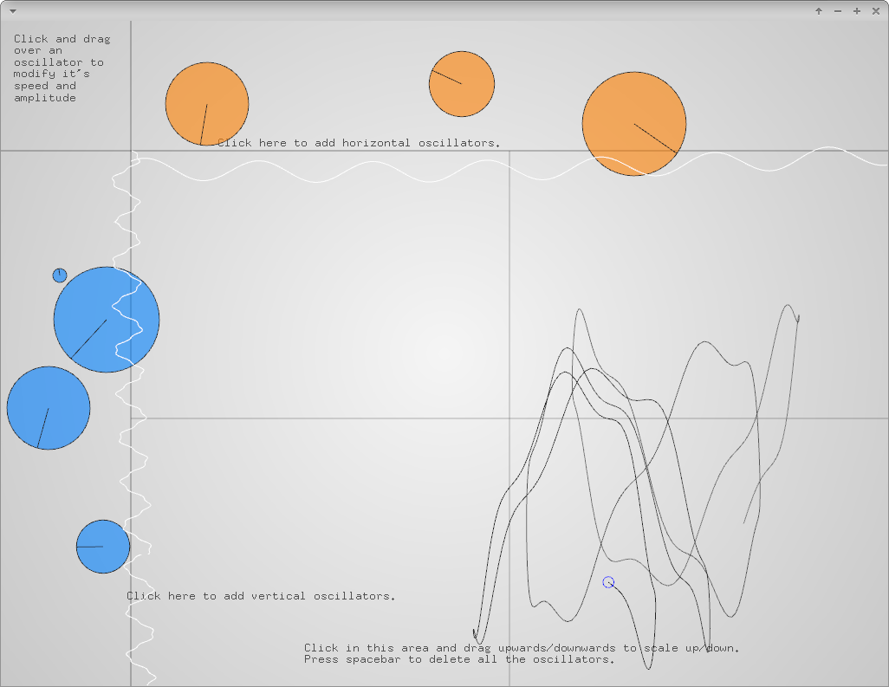

# trigonometricMotionExample



### Learning Objectives

This example demonstrates how to apply trigonometric functions to a motion on the screen. You can create multiple sinus oscillators. The orange bunch of oscillators will determine the horizontal motion of the drawing line, the blue ones will determine the vertical motion. Both directions of motion are computed by adding the respective oscillators.

You will learn how to ..
* create your own oscillator class storing its frequency, amplitude, phase etc.
* add sinus waves from multiple oscillators to one frequency
* save that frequency into an array storing the frequencies history
* create an [ofMesh](http://openframeworks.cc/documentation/3d/ofMesh/) illustrating the history of two frequencies


### Expected Behavior

When launching this app, you should see a screen divided into different areas. The top and the left bar are used to create new oscillators. The main area is used to display the line controlled my the oscillators. It will show a non moving point at the beginning since there are no oscillators created yet. Once you add oscillators, you will see a visualization of the added frequencies of the vertical oscillators on the border of the left bar. The added frequencies of the horizontal oscillators will be displayed as waves on the border of the top bar. The resulting line visualizes the history of these two waves, the left wave controlling the vertical position of the line points, the top wave controlling the horizontal positions.

Instructions for use:

* Click into the top area to create oscillators controlling the horizontal movement of the line
* Click into the left area to create oscillators controlling the vertical movement of the line
* Click and drag over an oscillator to modify it's speed and altitude
* Press ```space``` to delete all the oscillators

### Other classes used in this file

This Example uses the following classes:

* [ofMesh](http://openframeworks.cc/documentation/3d/ofMesh/)
