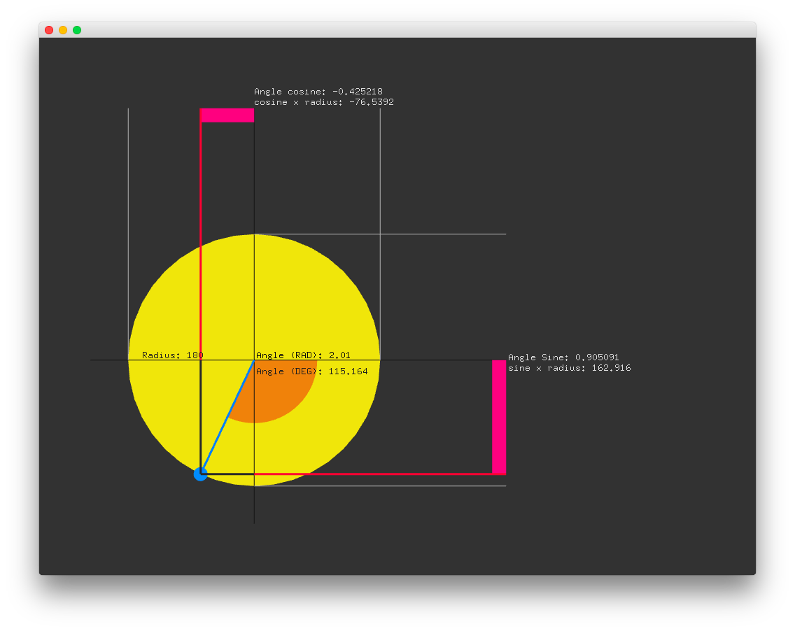

#level1_trigonometryExample
--


### Learning Objectives

This openFrameworks Example is designed to demonstrate how to move a point around a circle using sin and cosine and demonstrate angles and radians.

In this example, pay attention to the following code: 

* [Trig functions](https://en.wikipedia.org/wiki/Trigonometric_functions) that use angles and return values between -1 and 1,  ```cos(angle)```, ```sin(angle)```, ```tan(angle)```
* Trig functions are based on the unit circle that has a radius of one; therefore, the circumference is 2 * radius * PI = 2 * 1 * PI = 2 * PI. openFrameworks has a variable for 2 * PI, ```TWO_PI```
* ```ofPoint point``` is used to store the center point of the blue ball; the x and y value of point is changed using ```cos(angle)``` &  ```sin(angle)``` 


### Expected Behavior

When launching this app, you should see:

* a yellow circle with a small blue circle moving around the circumference of the yellow circle, 
* a horiztonal and vertical line attached to the center of the blue ball visualizing sine and cosine angle respectively

Instructions for use:

* Press and release the mouse clicker inside of the yellow circle, and the blue ball will restart its rotation around the yellow ball at this position
* Hold down the mouse clicker and drag your mouse inside of the yellow circle to control the rotation of the blue circle

### Other classes used in this file

This Example uses no additional classes.


