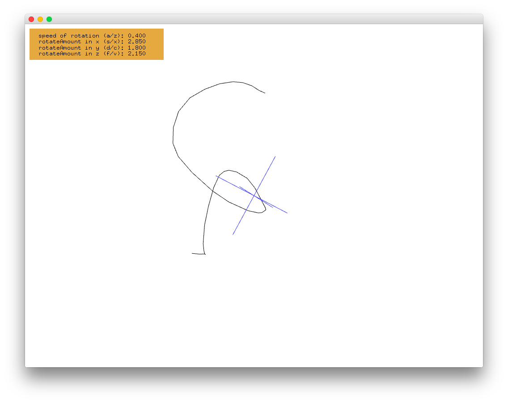

#level1_vectorMathExample
--


### Learning Objectives

This openFrameworks Example is designed to demonstrate 
[vector math](http://openframeworks.cc/tutorials/02_maths/001_vector_maths/) and how to draw using vectors.  Note, a vector represents a direction and magnitude in an abstract "space".

In this example, pay attention to the following code: 

*  ```glm::vec3	pts[MAX_N_PTS]```, declares a vector named 'pts' that cannot hold more than ```MAX_N_PTS``` which is defined at the top of the header file with ```#define MAX_N_PTS```
*  ```ofBeginShape()```, called to start drawing a new shape. 
*  ```ofBeginShape()``` is followed by a list of vertex points, ```ofVertex(pts[i].x, pts[i].y)``` and ends with a call to ```ofEndShape()```
*  ```pts[nPts].x = x``` &  ```pts[nPts].y = y``` sets a specific value position nPts in the vector 


### Expected Behavior

When launching this app, you should see:

* a rotating x, y, and z axis in blue; although, only the x and y axis will be visible due to the default orientation of the app
* a mustard yellow legend in the upper left corner with labels for the speed of rotation and rotateAmount in x, y, and z

Instructions for use:

* Hold down the mouse clicker and drag the mouse to draw
* Each point will be stored in vector 'Pts' 
* You can rotate the screen using the following key commands:
  * A - increase rotation speed
  * Z - decrease rotation speed
  * S - increase the rotation amount in the x-direction
  * X - decrease the rotation amount in the x-direction
  * D - increase the rotation amount in the y-direction
  * C - decrease the rotation amount in the y-direction
  * F - increase the rotation amount in the z-direction
  * V - decrease the rotation amount in the z-direction
* Press the mouse once to clear the screen

### Other classes used in this file

This Example uses no additional classes. 


