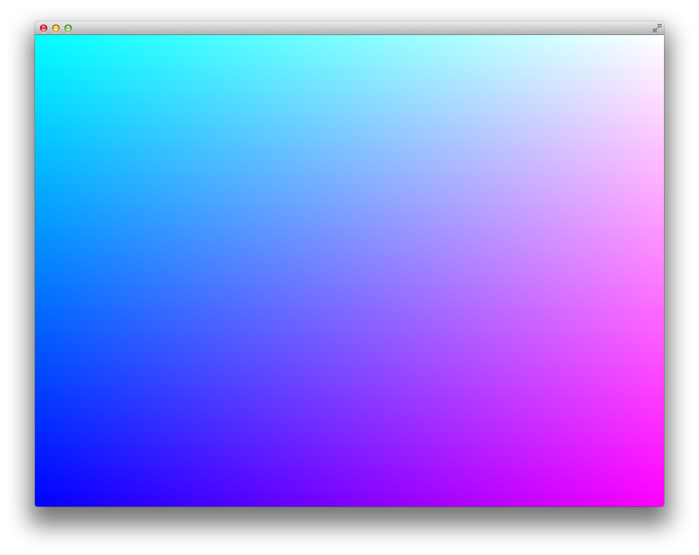

# About 01_simpleColorQuad



### Learning Objectives

This series of shader examples is designed to work along with the Intro to Shaders chapter of ofBook, which is available in the "Learning" page of the OF website under *ofBook / Graphics / Introducing Shaders*.

This example covers the following topics:

* loading a shader from a .vert file and a .frag file.
* writing simple GLSL shader files
* using begin() and end() calls on the shader to alter the drawing that the application is doing

In the code, pay attention to: 

* Comment and uncomment the calls to ```shader.begin()``` and ```shader.end()``` to see what happens when the shader is not called
* Note that these examples use OpenGL3 and have an extra call to specify OpenGL3 in the main.cpp: ```settings.setGLVersion(3,2);```
* Try different *r, g, b*, and *a* values in the shader.frag file, keeping within the range of 0.0 to 1.0

### Expected Behavior

When launching this app, you should see a rectangle drawn to the full size of the window, with a gradient fill across the entire window.

### Instructions for use:

There is no keyboard interaction, but changing color values in the .frag file will change the appearance of the gradient.

### Other classes used in this file

This example uses no other classes.
