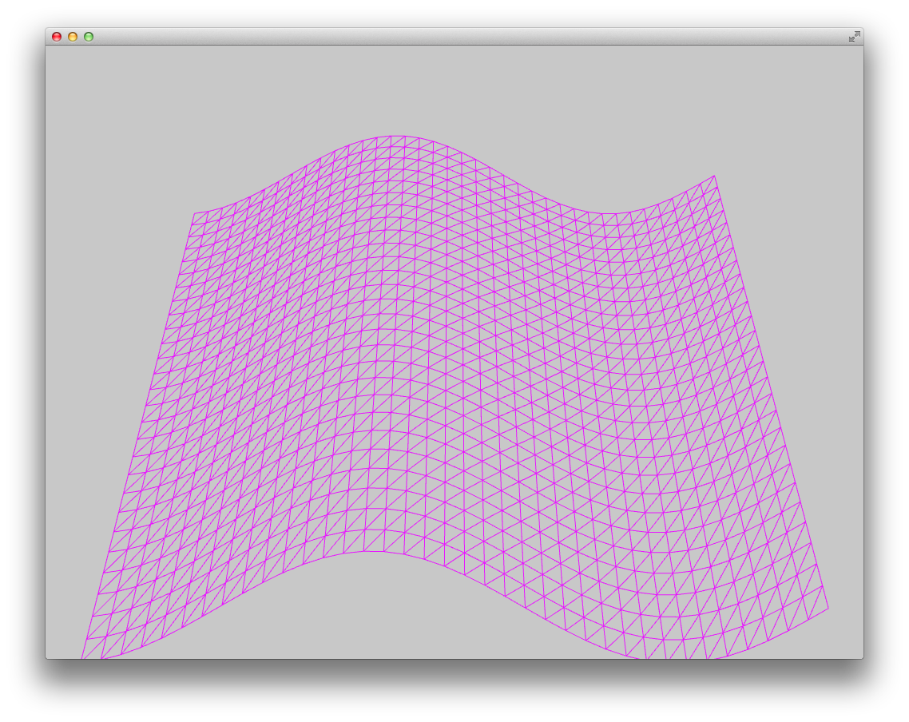

# About 02_simpleVertexDisplacement




### Learning Objectives

This series of shader examples is designed to work along with the Intro to Shaders chapter of ofBook, which is available in the "Learning" page of the OF website under *ofBook / Graphics / Introducing Shaders*.

This example covers the following topics:

* drawing a plane from vertices
* using uniforms to pass values from the ofApp into the shader
* using shader.vert to move vertex location
* passing color through ofSetColor to the shader.frag

In the code, pay attention to: 

* Passing variables from the ofApp draw():  
	```shader.setUniform1f("name", value);```
* Make sure your variable names match between ofApp and shader for passing values
* use of globalColor in shader.frag for passing the value of ofSetColor() each time it's called in the ofApp (draw) 
* Explore different values for displacementHeight in shader.vert to change the curvature of the sine wave


### Expected Behavior

When launching this app, you should see a triangulated mesh plane animating in the shape of a sine wave. The plane should move and change color with mouse movement.

### Instructions for use:

Moving the mouse in the X axis will change the uniform color across the vertex plane. Moving the mouse in the Y axis will rotate the plane around the X axis.

### Other classes used in this file

This example uses no other classes.
