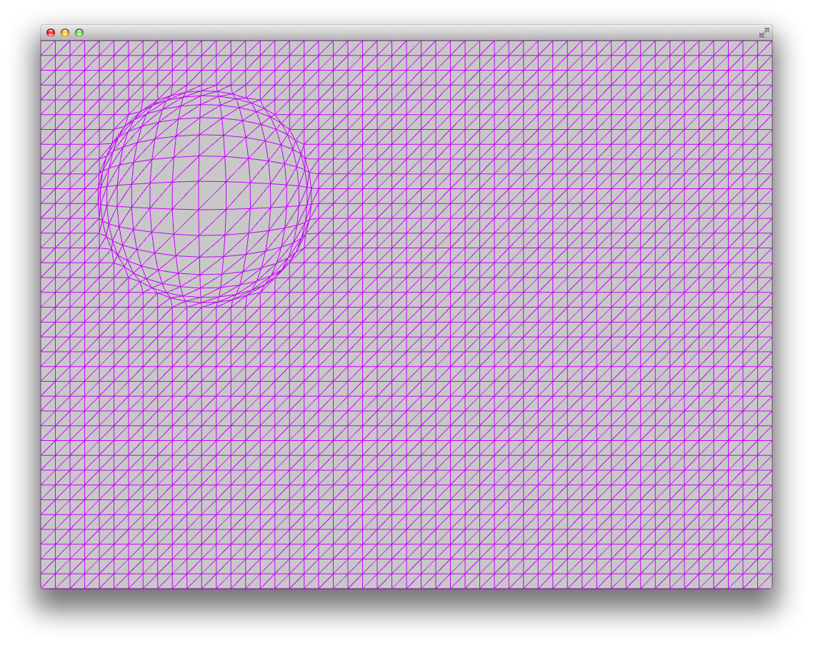

# About 03_simpleShaderInteraction




### Learning Objectives

This series of shader examples is designed to work along with the Intro to Shaders chapter of ofBook, which is available in the "Learning" page of the OF website under *ofBook / Graphics / Introducing Shaders*.

This example covers the following topics:

* using shader.setUniform2f() to pass two-dimensional values (like mouse position)into a shader 
* using shader.setUniform4fv() to pass four values into a shader as a float array
* creating interaction between mouse position and vertex position, for each vertex in a plane

In the code, pay attention to: 

* Note the three different types of uniforms used:
	* Single floating point value ( ```shader.setUniform1f()``` )
	* A 2 float vector ( ```shader.setUniform2f()``` )
	* A vector of 4 floating point values ( ```shader.setUniform4v()``` )
*  In shader.vert, gl_Position is modified by the location of the mouse relative to its own position.


### Expected Behavior

When launching this app, you should see a triangulated mesh plane across the window surface, with a displaced circle of vertices around the mouse.

### Instructions for use:

Moving the mouse will change the section of displaced vertices, following the mouse around the window. Moving the mouse will also change the uniform color of the plane mesh.

### Other classes used in this file

This example uses no other classes.