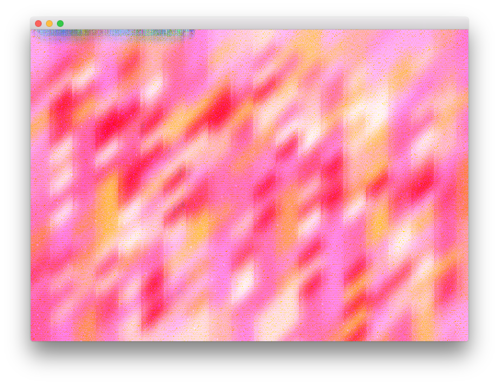

# About Gaussian Blue Filter Example



### Learning Objectives

This openFrameworks example demonstrates how to apply a gaussian blur filter to an image in multiple passes.

* Use of ```shaderBlurX``` and ```shaderBlurY```, two [ofShader](http://openframeworks.cc/documentation/gl/ofShader/) objects
* Use of ```fboBlurOnePass``` and ```fboBlurTwoPass```, two [ofFbo] (http://openframeworks.cc/documentation/gl/ofFbo/) objects use as offscreen rendering containers
* Blur amount deteremined by position of the mouse: ```float blur = ofMap(mouseX, 0, ofGetWidth(), 0, 10, true);```
* Use of ```shaderBlurX.setUniform1f("blurAmnt", blur);``` to the set the horizontal blur amount
* Use of ```shaderBlurY.setUniform1f("blurAmnt", blur);``` to the set the vertical blur amount

### Expected Behavior

When launching this application, you will see a brightly patterned image. 

Instructions for use:

* Move the mouse on the horizon to see the increase the blur amount


### Other classes used in this file

No other classes were used for this example. 