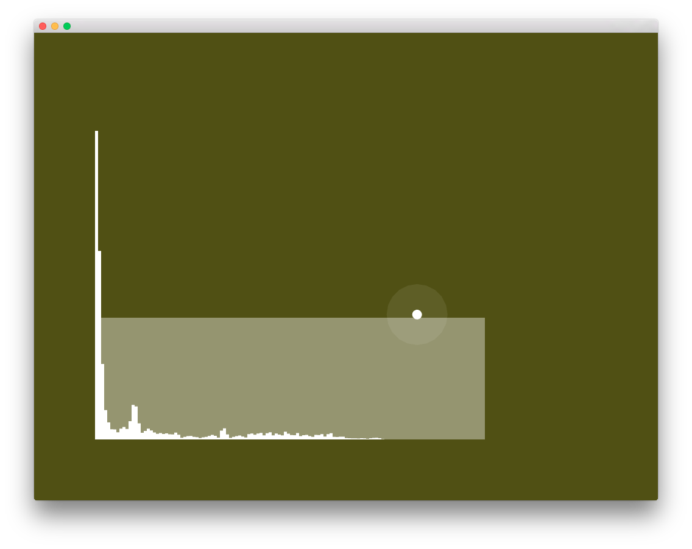

# About sound

### Learning Objectives

In this section, you will find examples of working with sound in openFrameworks (loading a sound file, synthesizing sound in OF, and more).

### Table of Contents

* [audioInputExample](audioInputExample/)
* [audioOutputExample](audioOutputExample/)
* [soundBufferExample](soundBufferExample/) - Plays sounds using ``ofSoundBuffer`` (3 sine oscillators and 3 LFOs)
* [soundPlayerExample](soundPlayerExample/) - Loading sound files from your disk and allowing the user to change the playback speed interactively.
* [soundPlayerFFTExample](soundPlayerFFTExample/)

### At a Glance

[audioInputExample](audioInputExample/)

[audioOutputExample](audioOutputExample/)

[soundBufferExample](soundBufferExample/)

[soundPlayerExample](soundPlayerExample/)

[soundPlayerFFTExample](soundPlayerFFTExample/)

