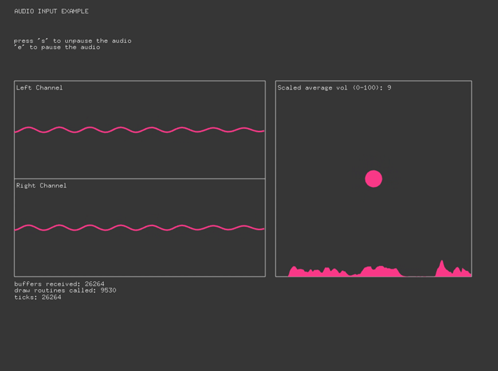

#audioInputExample
--

### Learning Objectives

This openFrameworks example is designed to demonstrate how to access, extract, and draw from your audio input's raw data.

Studying the code behind this example will help you understand:

* How to list all available audio devices with `soundStream.printDeviceList()` and set a specific audio input device for OF app with `settings.setInDevice(devices[0])`
* How audio functions work independent from draw and update loop by observe `bufferCounter` and `drawCounter`
* How to roughly calculate volume by using RMS (root mean square) value in `void audioIn` 
* How to record data overtime with vector with `vector <float> volHistory`

### Expected Behavior

When launching this app, you should see 

* Fast moving curve lines on the left, and big circle on the right that reacts to live audio input
* Graph of recorded volume data overtime under the big circle
* Text that shows difference in draw vs buffer counter

Instructions for use:

* make some noise or touch your microphone to see how sound manipulate the drawing.
* press `e` to stop live audio input, `s` to continue 

### Classes used in this example

This example uses the following classes: 

* ``ofSoundStream``
* ``ofSoundStreamSettings``