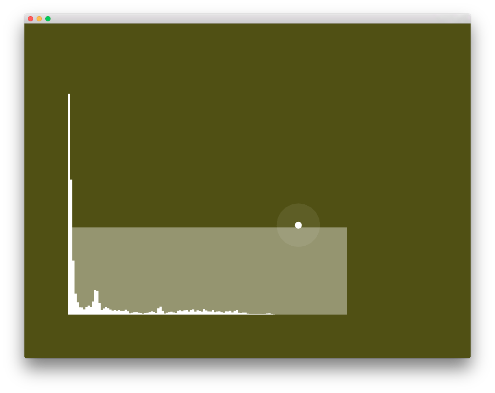

# soundPlayerFFTExample

### Learning Objectives

This openFrameworks example demonstrates how to visualize an FFT analysis of the sound that is currently being played.

Studying this example will help you understand:

* how to use ``ofSoundPlayer`` to load and play sound files. (see also ``soundPlayerExample``)
* how to allow the user to move a circle around the screen (that bounces off the window edges) by changing its velocity (depending on the cursor position, see ``mouseDragged()``)
* how to check for collision (and play a sound if the circle collides with window edges), see ``update()`` function.
* how to use ``ofSoundGetSpectrum()`` to get a frequency spectrum sample for the FFT.

### Expected Behavior

Whenever the white circle collides with the border of the window, a sound should play. Each border (top, bottom, left, and right) corresponds to a different sound file. 

In the center of the window, you should see an FFT visualization of the sounds that are currently played.

Instructions for use:

* Drag the circle around and release it to make it move around the screen and to play sounds.

### Classes used in this example

This example uses the following classes: 

* ``ofSoundPlayer``