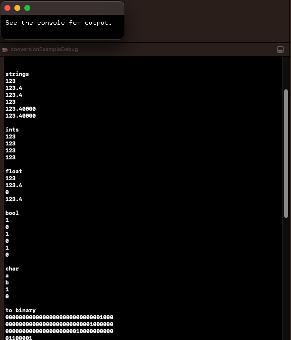

# conversionExample



### Learning Objectives

This example demonstrates how convert to and from strings for different data types.

### Expected Behavior

When launching this app, you should see a screen directing your attention to the console.

Instructions for use:

* Check the console for the output of the functions in ```setup().```

### Other classes used in this file

This Example uses no other classes.
