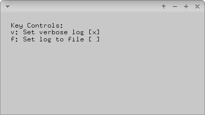

# loggingExample



### Learning Objectives

This example demonstrates how to log things on different levels. You can differentiate between these levels:
* ```OF_LOG_VERBOSE```
* ```OF_LOG_NOTICE```
* ```OF_LOG_WARNING```
* ```OF_LOG_ERROR```
* ```OF_LOG_FATAL_ERROR```
* ```OF_LOG_SILENT```

You will learn how to..
* set log levels via ```ofSetLogLevel(..)```
* write logs via ```ofLog(..)``` or via different log level functions like ```ofLogVerbose(..)```
* write logs into the console or into a file via ```ofLogToFile(..)``` or ```ofLogToConsole(..)```


### Expected Behavior

When launching this app, you should see a screen with instructions. The logging is printed to the console by default but can be changed to be added to a file.

Instructions for use:

* Press ```x``` to toggle verbose log
* press ```f``` to switch between file or console output

### Other classes used in this file

This Example uses the following classes:

* http://openframeworks.cc/documentation/utils/ofLog/
