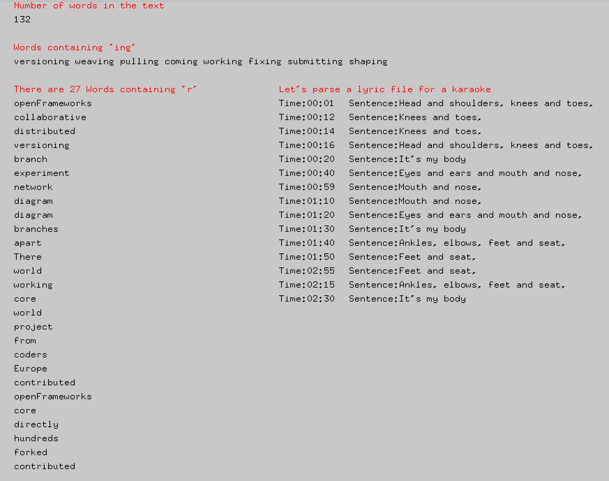

# regularExpressionExample



### Learning Objectives

This example demonstrates how to parse a string using regluar expressions.
* use ```std::regex``` to retrieve relevant information from a string

### Expected Behavior

When launching this app, you should see a screen divided into two columns. On the left side we perform a text search using regular expression on a string contained in our application. On the right column we parse a file loaded from our data folder


### Useful c++ references

http://en.cppreference.com/w/cpp/regex/match_results
http://en.cppreference.com/w/cpp/regex/regex_search
http://en.cppreference.com/w/cpp/regex/regex_iterator

This Example uses the following classes:

* http://openframeworks.cc/documentation/utils/ofFile/
