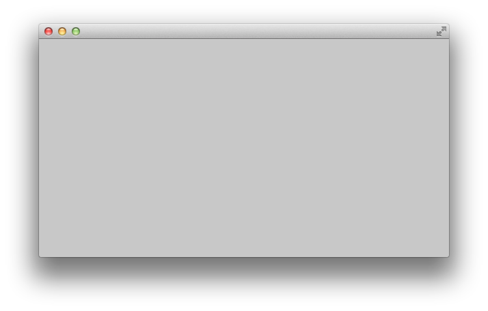

# About allAddonsExample



### Learning Objectives

This example is designed as a test-program: to make sure that all of the various extension libraries which come with openFrameworks (the "core addons") are compiling properly, and without conflicts. 

In the ```.h``` file, you'll notice a bunch of ```#include``` lines. These import the functionality of nine powerful open-source libraries made by other developers, communities and organizations.

```cpp
#include "ofxOpenCv.h"
#include "ofxNetwork.h"
#include "ofxOsc.h"
#include "ofxXmlSettings.h"
#include "ofxAssimpModelLoader.h"
#include "ofxThreadedImageLoader.h"
#include "ofxKinect.h"
#include "ofxGui.h"
#include "ofxSvg.h"
```

You'll also see declarations for some instances of objects from these libraries:

```
	ofxCvGrayscaleImage cvGray;
	ofxTCPClient client;
	ofxTCPServer server;
	ofxOscSender osc_sender;
	ofxXmlSettings settings;
	ofxAssimpModelLoader betterModelLoader;
	ofxThreadedImageLoader threadedLoader;
	ofxKinect kinect;
	ofxPanel gui;
	ofxSVG svg;
```

Note that including an addon's `.h` file and declaring an instance one of its objects is *not* sufficient for that addon to work properly! The addon also has to be added to your project file (i.e. your XCode `.xcodeproj` or your VisualStudio `.sln`). To do that, consider using the OF ProjectGenerator, or check documentation about "How to add an addon to openFrameworks". 

The *allAddonsExample* is useful for making sure that all of your core addons are working as they should. It can also be useful as a "starter template" for making programs that might need a wide variety of advanced functionality. If you need to make an app that does computer vision with Kinect data, loads 3D models, and sends OSC data over the network -- here's a place to start.


### Expected Behavior

When launching this app, you should see a small light-gray window. 

There's nothing else to see or do. In this sense, this program behaves similarly to the openFrameworks *emptyExample*. The crucial difference with the *allAddonsExample* however, is that the functionality of nine powerful addons lies dormant in the background.

Because of all the additional libraries that have been compiled into this app, the size of the compiled *allAddonsExample* binary may be larger than usual. 

### Other classes used in this file

This example links against the following nine core addons:

* ofxOpenCv
* ofxNetwork
* ofxOsc
* ofxXmlSettings
* ofxAssimpModelLoader
* ofxThreadedImageLoader
* ofxKinect
* ofxGui
* ofxSvg